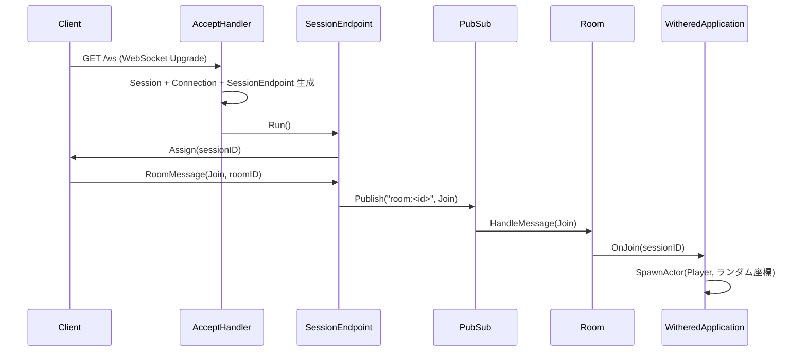
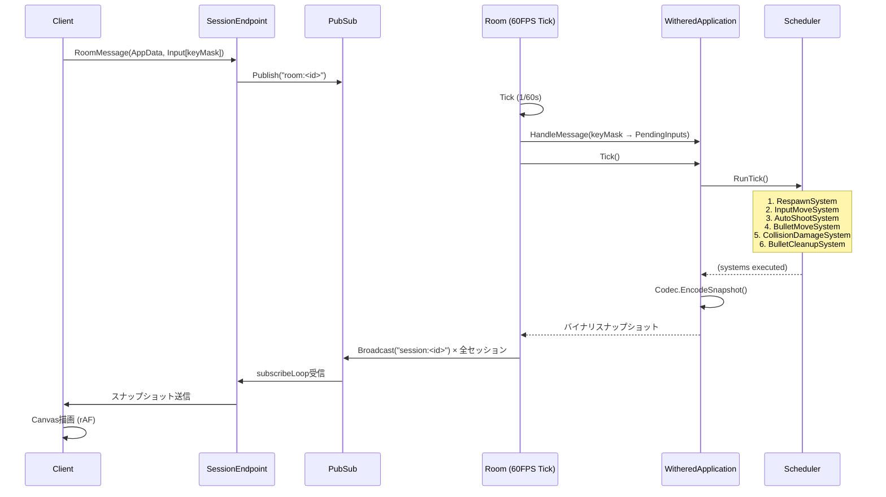
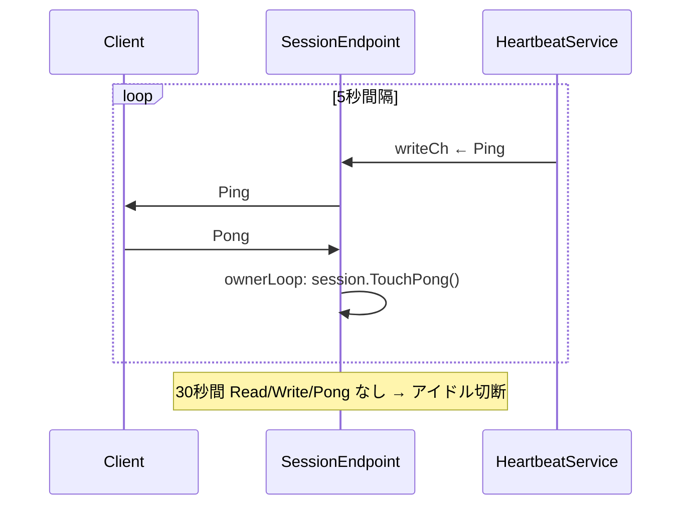

# withered - プロジェクト概要

## 概要

- **tanzlaurel** モノリポ内の `withered/` サブプロジェクト
- WebSocketベースのリアルタイム2Dマルチプレイヤーシューティングゲーム
- サーバーが60FPSのゲームループを駆動し、ECSスナップショットをクライアントにブロードキャストする
- 同リポには `flourish/`（CRDTブログサービス）と `observer/`（OTel + Grafana観測基盤）も存在

## 技術スタック

| レイヤー | 技術 |
|---|---|
| サーバー | Go 1.26, `github.com/coder/websocket`, `go.uber.org/mock`, `golang.org/x/sync` |
| クライアント | TypeScript, Vite 7, Canvas 2D API（フレームワーク不使用） |
| E2Eテスト | Playwright |
| プロトコル | 独自バイナリ（QUIC/MOQT風varintヘッダ + リトルエンディアンECSスナップショット） |
| インフラ | Docker Compose, Cloudflare Tunnel, Ansible（※ `observer/` にGrafana/Loki/Tempo） |

## アーキテクチャ（レイヤー構成・主要モジュール）

```
withered/
├── server/
│   ├── cmd/main.go          # エントリーポイント（HTTPサーバー起動 + Room起動）
│   ├── server.go            # net/http.Server ラッパー
│   ├── router.go            # ルーティング（/ws, /health）
│   ├── handler/
│   │   ├── accept.go        # WS接続ハンドラ（Session/Connection/Endpoint生成）
│   │   └── health.go        # ヘルスチェック
│   ├── domain/              # ドメイン層（トランスポート非依存）
│   │   ├── session.go       # セッション管理（アイドル検知, atomic timestamps）
│   │   ├── session_endpoint.go  # 接続ごとの制御ハブ（read/write/subscribe/ownerループ）
│   │   ├── room.go          # ゲームルーム（60FPSティックループ, ブロードキャスト）
│   │   ├── room_manager.go  # ルーム割当（現在はデフォルト1部屋）
│   │   ├── connection.go    # WebSocket接続の抽象化
│   │   ├── transport.go     # I/Oインターフェース（Read/Write/Close）
│   │   ├── pubsub.go        # インプロセスPub/Sub（session/roomトピック）
│   │   ├── heartbeat_service.go  # 5秒間隔Ping送信
│   │   └── application.go   # ゲームロジックインターフェース
│   └── application/         # アプリケーション層（ECSゲームロジック）
│       ├── withered_application.go  # Application実装（Join/Leave/Tick/HandleMessage）
│       ├── world.go         # ECSワールド（Position, Health, Velocity等コンポーネント）
│       ├── phase.go         # ECSシステム群（移動, 射撃, 弾丸, 衝突, リスポーン）
│       ├── schedular.go     # トポロジカルソートによるシステム実行順序管理
│       ├── codec.go         # バイナリスナップショットエンコーダ
│       ├── map.go           # タイルマップ（100×100, Empty/Wall/Water）
│       ├── bullet.go        # ゲームバランス定数
│       └── buffer.go        # 入力バッファ（PendingInput）
├── client/                  # Vite + TypeScript クライアント
│   └── src/
│       ├── main.ts          # エントリーポイント
│       ├── game.ts          # ゲームコントローラ（WS接続, スナップショット適用, rAFループ）
│       ├── websocket.ts     # WebSocketクライアント
│       ├── protocol.ts      # バイナリプロトコル（エンコード/デコード）
│       ├── renderer.ts      # Canvas 2D描画（800×800px, 8px/unit）
│       ├── input.ts         # WASD入力マネージャ
│       ├── event-logger.ts  # イベントログ（リングバッファ1000件）
│       └── log-panel.ts     # デバッグログUI
├── e2e/                     # Playwright E2Eテスト
├── utils/                   # 共有ユーティリティ（getenv, エラー型）
├── go.mod
└── Makefile
```

### レイヤー間の依存関係

- `handler/` → `domain/`（Session, Connection, SessionEndpoint を生成）
- `domain/` → `application/`（`Application` インターフェース経由、依存逆転）
- `application/` は `domain/` のインターフェースのみに依存

## API（主要エンドポイント一覧・認証方式）

### HTTPエンドポイント

| メソッド | パス | 説明 |
|---|---|---|
| GET | `/ws` | WebSocketアップグレード（ゲーム接続） |
| GET | `/health` | ヘルスチェック（200 OK） |

- **認証方式**: なし（※ `docs/progress.md` にTODOとして記載あり）
- **デフォルトアドレス**: `localhost:9090`（環境変数 `ADDR`, `PORT` で変更可能）

### WebSocketプロトコル（バイナリ）

3層構造:

```
[MsgType: varint][TotalLen: varint]         ← トランスポートヘッダ
  [RoomIDLen: varint][RoomID: bytes][RoomMsgType: varint]  ← ルームヘッダ
    [DataType: u8][SubType: u8][Payload...]  ← アプリケーションペイロード
```

| MsgType | 方向 | 説明 |
|---|---|---|
| `0x00` RoomMessage | 双方向 | ルームデータ（Join/Leave/AppData） |
| `0x01` Ping | S→C | サーバーからのPing（5秒間隔） |
| `0x02` Pong | C→S | クライアントからのPong応答 |
| `0x03` Assign | S→C | セッションID割当（接続直後、16バイト） |

| RoomMsgType | 説明 |
|---|---|
| `0x00` Join | ルーム参加 |
| `0x01` Leave | ルーム離脱 |
| `0x02` AppData | ゲームデータ |

| DataType | 説明 |
|---|---|
| `0` Input | キー入力（W=0x01, A=0x02, S=0x04, D=0x08） |
| `5` Snapshot | ECSフルスナップショット（60FPS） |

## ユースケース（主要なデータの流れ）

### 接続〜ゲーム開始フロー



### ゲームループ（60FPS）



### ハートビート



## セットアップ手順

```bash
# 1. リポジトリクローン
git clone https://github.com/touka-aoi/tanzlaurel.git
cd tanzlaurel/withered

# 2. 依存インストール
make install          # client/の npm install

# 3. 一括起動（サーバー + クライアント + AIボット×3）
make dev

# 個別起動
make server           # Go サーバー (localhost:9090)
make client           # Vite dev server
BOT_COUNT=5 make bot  # ボット数を指定して起動

# 4. ブラウザでアクセス
# Vite dev serverのURL（通常 http://localhost:5173）
```

### その他のコマンド

| コマンド | 説明 |
|---|---|
| `make test` | Go テスト実行 |
| `make e2e` | Playwright E2Eテスト（サーバー:9091 + Vite:5174 を自動起動） |
| `make generate-mock` | `go.uber.org/mock` によるモック生成 |
| `cd client && npm run build` | クライアントビルド |

### 前提条件

- Go 1.26+
- Node.js（※ `.tool-versions` で管理）
- npm

## 開発フロー

- **ブランチ戦略**: mainブランチからフィーチャーブランチを切り、PRでマージ
- **コミット**: Conventional Commits形式、日本語メッセージ
- **テスト**: `make test`（Goユニットテスト）→ `make e2e`（Playwright統合テスト）
- **コードレビュー**: コミット前に3回セルフレビュー（CLAUDE.md規約）
- **進捗管理**: `docs/progress.md` にコミットごとに記録
- **設計記録**: `docs/adr/` にArchitecture Decision Recordsを残す
- **エラーハンドリング**: `TanzError` 構造体で `slog` 統合（`docs/error-handling.md` 参照）
- **モック**: `go.uber.org/mock` + `go generate`（`domain/transport.go` に生成指示あり）
- **デッドコード**: 発見次第即時削除（CLAUDE.md規約）
- **後方互換性**: 維持しない方針（CLAUDE.md規約）
